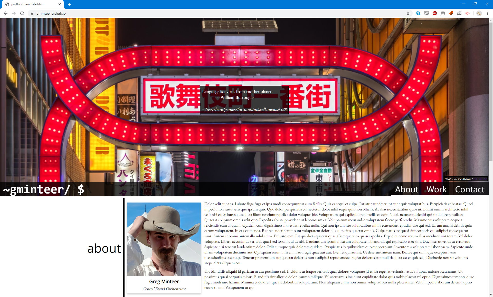

# [gminteer.github.io](https://gminteer.github.io)

## HTML, CSS, Vue

This respository is the landing page and portfolio for my github account: a responsive website supporting tablets, phones, and dark mode. Uses Vue and faker.js to fill in the page with randomly generated lorem content. At this point it's mostly a design mockup: content coming soon!
